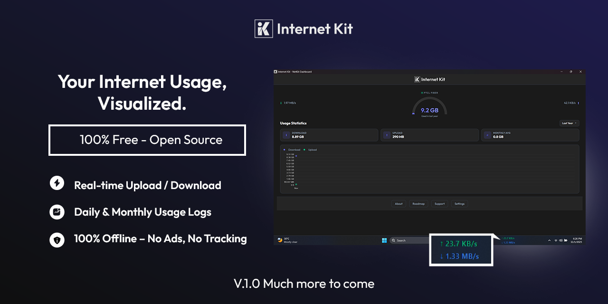

# Internet Kit - Network Speed Monitor



## 🚀 First Stable Release v1.0

We're excited to announce the first stable release of **Internet Kit**! After extensive development and testing, we're confident in delivering a reliable and production-ready network monitoring solution.

---

## 📖 About Internet Kit

Internet Kit is a modern, free, and open-source network monitoring tool designed for clarity, privacy, and control. Track your internet usage in real-time with a beautiful, responsive interface that puts you in control of your data.

**Key Highlights:**
- **Real-time Monitoring**: Live download/upload speed tracking
- **Year-Long Storage**: Comprehensive data retention with full 1-year history
- **Privacy First**: Your data stays on your device - no cloud, no tracking
- **Cross-Platform**: Works on Windows, macOS, and Linux
- **Modern Dashboard**: Beautiful web-based interface with dark theme

---

## ✨ Features

### 📊 Real-time Monitoring
- Live speed display with dynamic arc visualization
- Download/upload speed tracking in MB/s
- Network status and connection monitoring

### 📈 Historical Analytics
- **Full Year Data Storage**: Complete 1-year usage history
- 7-day, monthly, and yearly usage statistics
- Interactive charts and data visualization
- Peak usage tracking and trends analysis

### 🔒 Privacy & Control
- Local data storage only
- No internet connection required for core features
- Transparent, open-source code

### 🎨 Modern Interface
- Dark theme with gradient accents
- Responsive design for all screen sizes
- Smooth animations and transitions

### ⚡ Performance
- Lightweight background monitoring
- Efficient data storage and aggregation
- Minimal system resource usage

---

## 🛠 Installation

### Download Latest Release
Visit our [Releases page](https://github.com/sh44ni/internet-kit/releases) to download the latest version for your operating system.

### System Requirements
- **Windows**: Windows 10 or later
- **macOS**: macOS 10.14 or later  
- **Linux**: Ubuntu 18.04+ or equivalent
- **RAM**: 100MB minimum
- **Storage**: 50MB free space

---

## 🚀 Quick Start

1. **Download** the application for your platform
2. **Run** the executable - no installation required
3. **Monitor** real-time speeds in the overlay widget
4. **Open Dashboard** by right-clicking the overlay
5. **Explore** historical data and analytics

The application runs quietly in the background with a minimal overlay showing current speeds.

---

## 📊 Usage

### Overlay Widget
- Displays current download/upload speeds
- Draggable to any screen position
- Right-click for menu options

### Web Dashboard
- Access via right-click menu or auto-launch
- Real-time speed monitoring
- **Full Year Historical Data**: Analyze up to 12 months of usage
- Network information
- Multi-timeframe analysis (7 days, month, year, all time)

### Data Persistence
- Automatic data collection every second
- Local JSON storage in `~/NetSpeedData/`
- **Full 1-year data retention** with automatic cleanup
- Efficient storage format optimized for long-term use

---

## 🏗 Architecture
Internet Kit Application
├── Background Monitor (psutil-based)
├── Overlay Widget (tkinter)
├── Web Dashboard (HTTP server)
└── Local Data Storage (JSON with 1-year retention)

### Components
- **NetMonitor**: Core monitoring with threaded data collection
- **DataStore**: Efficient JSON storage with **full 1-year retention**
- **DashboardServer**: Modern web interface with Chart.js
- **MinimalOverlay**: System tray-like speed display

---

## 🔧 Technical Details

### Data Collection
- Network I/O monitoring via `psutil`
- 1-second sampling intervals
- Atomic JSON writes for data safety
- **Automatic cleanup of records older than 1 year**

### Storage Format
```json
{
  "timestamp": "2024-01-15T10:30:00",
  "down": 1250000,
  "up": 250000,
  "total_down": 1500000000,
  "total_up": 300000000
}

API Endpoints
/api/live - Current speed data

/api/history - Historical data by timeframe (up to 1 year)

/api/summary - Usage statistics

/api/network - Network information

Development Setup
bash
git clone https://github.com/sh44ni/internet-kit.git
cd internet-kit
pip install -r requirements.txt
python main.py
Building from Source
bash
pyinstaller --onefile --windowed --add-data "assets;assets" main.py
📄 License
This project is licensed under the MIT License - see the LICENSE file for details.

🐛 Reporting Issues
Found a bug or have a feature request? Please open an issue with detailed information.

🌟 Roadmap
In Development
🎨 Theme customization (dark/light mode)

📱 Per-application data usage tracking

🌐 Network-aware statistics (Wi-Fi/Ethernet/VPN)

Planned Features
📊 Data export (CSV/PDF reports)

🔔 Usage alerts and notifications

📈 Advanced analytics and insights

🔧 Customizable data retention periods

📞 Support
📧 Email: support@internetkit.app

💬 Discussions: GitHub Discussions

🐛 Bug Reports: GitHub Issues

📚 Documentation: Project Wiki

🔒 Privacy Policy
Internet Kit respects your privacy:

All data stored locally on your device

No internet connection required for monitoring

No data sent to external servers

Open-source code for transparency

Your full year of data remains entirely under your control